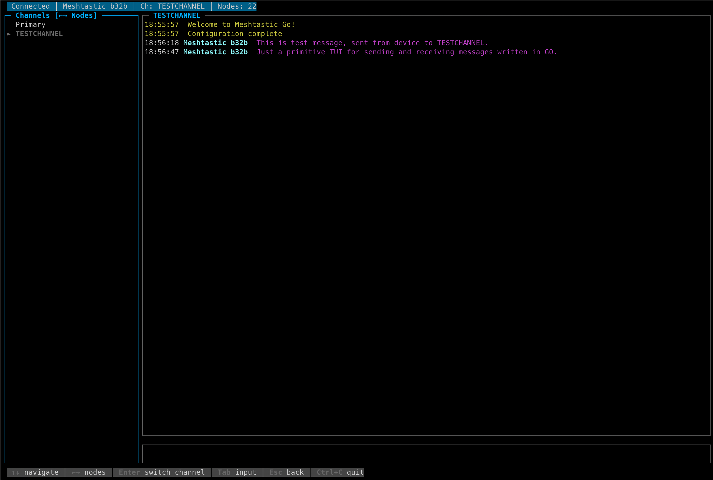
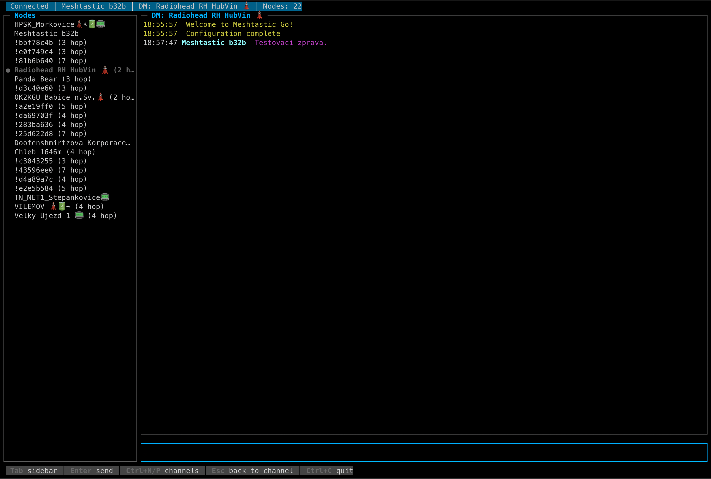

# Meshtastic Go

A terminal user interface (TUI) client for [Meshtastic](https://meshtastic.org/) LoRa mesh networking devices. Connect a Meshtastic radio via USB and chat on channels or send direct messages — all from your terminal.

Built with [termui](https://github.com/gizak/termui) and protobuf for the Meshtastic device protocol.

## Features




- **Refactored to use TermUI** - Used warp to refactor to use TermUI instead of Bubbletea.

- **Channel messaging** — send and receive on any configured channel
- **Direct messages** — DM any node in the mesh
- **Live node list** — scrollable, sorted by last heard, with hop count
- **Auto-detection** — finds Meshtastic USB devices by VID/PID
- **Cross-platform** — builds for macOS (ARM), Linux (AMD64/ARM), Windows (AMD64)
- **Keyboard-driven navigation** — focus-based input with a persistent help bar

## Prerequisites

- Go 1.21+
- A Meshtastic device connected via USB serial

## Build

```bash
# Build all platform targets
make build

# Build + lint
make

# Run locally (macOS ARM example)
./bin/meshtastic_go_darwin_arm64
```

## Run

Plug in a Meshtastic radio via USB, then launch the binary. The app auto-detects the serial port:

```bash
./bin/meshtastic_go_darwin_arm64   # macOS
./bin/meshtastic_go_linux_amd64   # Linux
./bin/meshtastic_go_linux_arm     # Linux ARM (Raspberry Pi)
```

On Windows:

```powershell
.\bin\meshtastic_go_windows_amd64.exe
```

A log file `meshtastic_go.log` is written to the current directory for diagnostics.

## TUI Navigation

The interface has three areas: **sidebar** (left), **message viewport** (right), and **text input** (bottom).

### Key bindings

| Focus   | Key         | Action                                  |
|---------|-------------|-----------------------------------------|
| Input   | `Tab`       | Switch focus to sidebar                 |
| Input   | `Enter`     | Send message                            |
| Input   | `Ctrl+N/P`  | Next / previous channel                 |
| Input   | `Esc`       | Return from DM to channel view          |
| Sidebar | `↑` `↓`     | Navigate items                          |
| Sidebar | `←` `→`     | Switch between Channels / Nodes tabs    |
| Sidebar | `Enter`     | Select channel or start DM with node    |
| Sidebar | `Tab`       | Switch focus back to input              |
| Sidebar | `Esc`       | Back to input + channel view            |
| Any     | `Ctrl+C`    | Quit                                    |

The help bar at the bottom always shows the relevant shortcuts for the current context.

## Test

```bash
go test ./...
```

## Lint

```bash
make lint
```

Or via [Trunk](https://trunk.io):

```bash
trunk check
```

## Project Structure

```
cmd/main.go              — Entry point: serial → transport → UI
pkg/serial/              — USB device discovery and serial port connection
internal/transport/      — Protocol framing (StreamConn), Client, typed events
internal/ui/             — termui TUI (event loop, widgets, key handling)
internal/ui/store/       — Thread-safe message storage
pkg/generated/           — Auto-generated protobuf Go code (do not edit)
```

## Contributing

Fork the repository and create a pull request.

## License

This project is licensed under the MIT License — see the [LICENSE](LICENSE) file for details.

## Acknowledgments

- [Meshtastic](https://meshtastic.org/) for the open-source mesh networking protocol
- [termui](https://github.com/gizak/termui) for the terminal dashboard UI library
